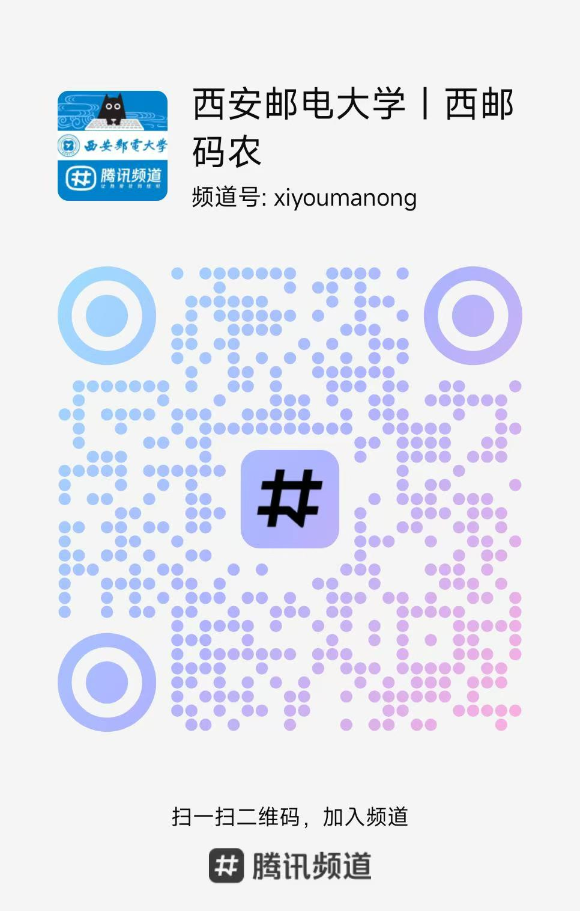

#  [就业\]21-网络工程 高鹏  @ 腾讯

## 基本背景

>姓名：高鹏
>
>专业：计算机学院 网络工程2101
>
>签约公司：深圳腾讯
>
>实验室：西邮Linux兴趣小组
>
>QQ邮箱：1285719445@qq.com，联系加QQ或者发邮箱
>
>频道：QQ搜索西邮码农频道，全称 “西安邮电大学| 西邮码农” ，包含各实验室的培养方案、学长学姐飞跃手册等等，一起学习讨论技术。

## 个人经历与思考

- 入学前

上大学前我是没有接触过编程的，高考后分数是刚够211分数低一点的专业，填报志愿时不太懂本想选物理专业高中比较感兴趣，但听家里人劝说后选报了计算机相关专业。最后进入了西邮，一看是双非。本来想法肯定是考研，这是一个河北小镇做题家对于985、211的执念。

- 初入学后

​        进入大学后，各种社团等组织眼花缭乱，最后听说有一个组织叫做实验室，进去可以学习计算机技术，我对计算机世界还是比较好奇的。但是想进去得学C语言参加面试。于是接近国庆的时候随手打问同学捧起一本C语言书就开始看。学了一个星期便开始找各个实验室面试。面试了几个实验室都没有过，因为我学的时间比较短没有达到要求。最后面试了Linux兴趣小组，当时它纳新较晚，积累了前面的面试经验，费了九牛二虎力去写纳新题，二面时由于我还几乎没有上机经验，一道题也没有通过，但是我写了特别多的注释，每道题都有了自己的思路，终于好不容易拼过了面试。回头想，这段时间学习完全是门外汉也没有自己的学习方法，算是比较艰难的时刻了。

- 接触计算机

​        进入实验室后，就会按部就班很多，“看C语言书要看C primer plus”，“你去装一个Linux系统”，“每个人都要用谷歌搜索，不要用百度”，“学会看官方文档”，这些学长的经验每天萦绕在耳边，在实验室里算是上道了。后面有个acm新生赛，学了一周《啊哈算法》便去参加比赛，没想到做对了两道题就拿了个金牌。这是我第一次在编程获得自我认同感。（其余参与竞赛经历不再赘述）

- 竞赛的看法

​        这里提一下我对竞赛的看法，竞赛一方面除了能提升技术，更多的可能是有一些获奖之后的自我认同，以至于自己不太迷茫也能让自己自信一点。但是不是所有竞赛都要参加，也不是参加越多越好，你要知道自己想要的是什么。我自己的目标就是能尽可能把技术学广学深，所以比赛是没有参加特别多的，竞赛也是很消耗时间的，你做的东西就要符合它比赛的规范，像互联网加就要写很长的文档，ppt等等。当然不是说如电赛这种比赛。如果这些时间拿来学技术，看更多书可以获得更多输入。

- 大学学习回顾

​       整体回想，在实验室中的学习过程还是比较努力的。时常能学到晚上11点，也有过周末第一个来开实验室门的经历。暑假会留校做项目，疫情封了宿舍还完成了实验室的项目。整个学习过程也是比较享受不断学习技术接受输入的过程，享受形成一个个逻辑闭环的过程。不断学习的过程让我打算直接就业而不考研。当然也有很多做的不好的点，比如和其他同学交流太少了，没有和其他同学激烈的讨论。当时学习技术时也有疑惑，但是不敢暴露自己的不足，害怕觉得自己学得太少了。就自己一个人闷头在学，错过了很多能快速解决困惑的时刻。

- 关于实习及秋招

​       目前通常前后端岗位在大三上即寒假前找第一份日常实习，可以干3个月左右。我是特例学内核方向，内容较多，所以在大三下直接找的暑期实习（即有转正机会的实习）。

​       要明确的是，不管大三上找不找实习，大三下的暑期实习一定要认真找，不要一直在日常实习中死磕。金三银四战春招，即三月四月是找实习的黄金时期。现在大厂更倾向于暑期实习之后转正，而不是秋招。所以如果能在暑期实习得到一份不错的offer，并通过努力转正是很不错的。

​       在有一个转正offer的情况下到时九月十月再去秋招心态也更轻松。

​       关于如何能更好实习转正，那就是要在实习期间有一定的产出，或是能突显出你的技术实力，或是对于公司有一定实际用处。在实习过程中，让你的leader为你分配一些好的项目，而不是整个实习期都在做杂活，另外要时时关注你们组的可转正数情况，如果发现是养蛊，提前溜也不失为上策。

​       关于实习最好能实习两个公司，然后在不同的城市，多多体验不同的公司部门和城市。

## 如果现在我重回大一

如果现在我重回大一，仅从上帝视角来过一遍大学四年，我会如何度过？

首先总体来看，大学是非常自由的，仅有很少的时间是带有强制性的，比如期末考试，强制性会议等。其余时间都是可以自己安排的，包括上课时间，包括你是想早起7点起或者是早上11点起、包括周末如何度过。所以我们不应该被锁死，就去做自己你自己想做的事。可以去打游戏，也可以去旅游，可以看一些文学书等等都可以。

首先我在大一，如果笃定就业，（如果确定想要考研，那大学可以先玩两年，大三再开始学）一个事情就是加入一个实验室，根据自己喜欢的方向或者任意一个实验室。如果再给我一次机会，我还会加入Linux兴趣小组，哈哈。除了在实验室的时间，可以加两个自己喜欢的社团，另外会去西安周围逛上一逛。当然如果没有加入实验室同学也没关系，有不少同学是不在实验室通过自己学习就进了大厂，如果对于学习方向有迷茫，还请加入我创建的频道，QQ搜索西邮码农频道，01板块中为你答疑解惑或者发帖问问吧。

另外现在有一个特别好的帮手，那就是AI，它一方面可以给你写一些平时的大作业或者需要交的文档，另一方面它又可以是一个非常好的助手来答疑解惑。这在我当时学习时是不存在的，你大可以去刨根问底的问它技术问题，它会不厌其烦地来回答你。而且它越来越聪明，之前的chatgpt不断迭代，包括现在的claude3.7 Claude4.0。但是要保留自己的编程能力，不要在你学编程的时候都让ai来帮你写，自己动手敲是非常重要的。

一个好习惯是学技术要做好笔记，多发一发博客。计算机的知识是非常庞杂的，要把自己的理解最好记下来，或者是ai问答特别好的部分记录下来。知识是很容易被遗忘的，把一些关键的理解点记下来，分享出来还是比较重要的。

不断了解最新的东西和技术，学会用最好的学习资源来学习。就比如技术发展特别快，我们不能屏蔽ai，我们能做的就是顺应它发展。比如你是否知道Cursor是什么？

多和身边同学讨论，也不要歧视其他技术方向，不要错过一些干杂活的机会。

> 首先就是不要觉得自己菜就不敢问别人问题，歧视别人也不一定多厉害，大家一起多讨论讨论就把逻辑讲明白了。然后让自己的技术面宽一点，不要歧视其他的技术方向，就比如学后端但是我一点前端的东西都不会，我学软件但是一点硬件的东西都不懂，甚至觉得我一听不是自己方向的技术就烦。在ai的大背景下，一个程序员更要有更宽的技术面，甚至是全栈的能力，技术分深浅不分贵贱。

> 不要错过一些干杂活的机会，一个例子就是同学的毕设（不管怎么来的代码）跑不起来让你帮忙，不管是什么方向的毕设，或是机器学习，或是web，或者消息队列等等，你能不能在半天时间内让它跑起来。可能本身你不了解技术，但是你能把它修好。这就是实习过程中公司所看重的能力即工程实践的能力。快速了解相关技术，或借助谷歌、或借助ai，查官方文档，配好环境，修改几行代码，把代码跑起来。

​      如果要就业，学技术不是从大三开始准备项目准备面试，而是从大一进入校园之后开始的。另外学习计算机也不需要太多的天赋，只需要一点的逻辑能力，更多的是就向上面说的那样，日复一日，面试时就是把你整个大学获取的所有计算机知识吐露出来。无他，唯手熟尔。    

## 关于Linux基础及内核学习

当时选择内核方向是一个艰难的决定，一方面实验室中当时学长基本是C++/Go后端方向，内核方向已经断代，感谢陈莉君老师、18级胡庆伟学长让我有勇气进入内核领域。另一方面内核方向的就业岗位非常稀缺，在字节就是ste组，在腾讯teg中有部分岗位，符合要求。比较走钢丝，但是按路线来学，最后也会水到渠成。

首先装一个Linux系统，即将电脑变成双系统，平时学习就用Linux，新手就用ubuntu就可以。

上手玩一玩命令行，之后学习Linux系统编程和网络编程。

这部分具体可以查看Linux兴趣小组培养方案。

点击链接查看腾讯频道帖子[西邮Linux兴趣小组培养计划](https://pd.qq.com/s/5be4vm18g?b=2)

了解到这些系统调用之后，如果你还好奇它们是怎么实现的？好奇操作系统这个黑盒子是怎么做到这么强大的

那就可以踏入到内核学习中。

首先需要了解一些x86汇编，参考书籍：《x86从实模式到保护模式》

然后上一道硬菜，从零实现一个小型操作系统内核《操作系统真相还原》，自己动手，不断调试
书籍阅读搭配视频，徐东学长录制的全程学习视频讲解。

点击链接查看腾讯频道帖子[别再死磕书本！AI时代学操作系统，这招才是王炸](https://pd.qq.com/s/113hnzaqu?b=2)

啃下来之后就可以参加全国操作系统大赛：内核实现赛玩一玩。然后为关于操作系统的开源社区做一些贡献。

如果你还不满足，开始复现Linux2.4！

### 西安邮电大学| 西邮码农 频道

聚集各个实验室的培养计划，云集西邮毕业生的飞跃手册。对于学技术找工作有一定帮助，大家都可以进来
欢迎加入「西邮码农」频道，西邮人的吐槽日常，交流技术平台！

|  「西邮码农」频道 
|  ----  
|   

### 结尾

学技术，或是兴趣或是一种使命感，但是得长期一直学。闻道有先后，术业有专攻，如是而已！

